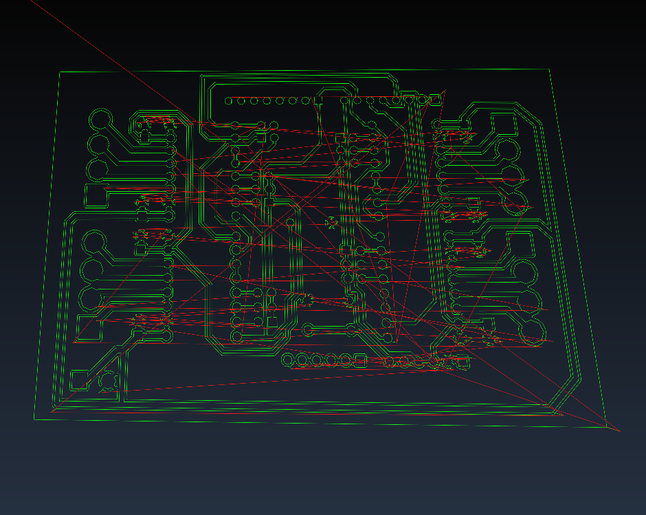

gbr2ngc
=======

Open source no frills Gerber to gcode converter, using (a slightly modified) [Clipper Lib](http://www.angusj.com/delphi/clipper.php).  Produces an isolation routing gcode file for the given Gerber file.

gbr2ngc will produce a GCode file like this:



from a Gerber file like this:


example usage:
--------------

    gbr2ngc --input example/example.gbr --radius 0.0025 --output example.ngc

Current version is in an alpha state, so use at your own risk.

command line options
---

```
$ gbr2ngc -h

gbr2ngc: A gerber to gcode converter
version 0.8.7

  usage: gbr2ngc [<options>] [<input_Gerber>] [-o <output_GCode_file>]

  -r, --radius radius                 radius (default 0) (units in inches)
  -F, --fillradius fillradius         radius to be used for fill pattern (default to radius above)
  -i, --input input                   input file
  -o, --output output                 output file (default stdout)
  -c, --config-file config-file       configuration file (default ./gbr2ngc.ini)
  -f, --feed feed                     feed rate (default 10)
  -s, --seek seek                     seek rate (add 'g0 f<rate>' to header if set)
  -z, --zsafe zsafe                   z safe height (default 0.1 inches)
  -Z, --zcut zcut                     z cut height (default -0.05 inches)
  -2, --gcode-header gcode-header     prepend custom G-code to the beginning of the program
  -3, --gcode-footer gcode-footer     append custom G-code to the end of the program
  -l, --segment-length segment-length minimum segment length
  -M, --metric                        output units in metric
  -I, --inches                        output units in inches (default)
  -C, --no-comment                    do not show comments
  -R, --machine-readable              machine readable (uppercase, no spaces in gcode)
  -H, --horizontal                    route out blank areas with a horizontal scan line technique
  -V, --vertical                      route out blank areas with a vertical scan line technique
  -G, --zengarden                     route out blank areas with a 'zen garden' technique
  -P, --print-polygon                 print polygon regions only (for debugging)
  --invertfill                        invert the fill pattern (experimental)
  --simple-infill                     infill copper polygons with pattern (currently only -H and -V supported)
  --no-outline                        do not route out outline when doing infill
  --height-file height-file           height file to use for height offseting
  --height-algorithm height-algorithm height algorithm to use (default Catmull-Rom) (options: catmull-rom, inverse-square, delaunay-linear)
  -v, --verbose                       verbose
  -N, --version                       display version information
  -h, --help                          help (this screen)

```

See the [documentation](doc/Documentation.md) for a more detailed description of each of the options.

Documentation
---

* [Usage documenation](doc/Documentation.md)
* [Developer documenation](doc/Developer-Documentation.md)

Compilation
---

    cd src
    make


Features
---

* `RS-274X` compliant
* Polyginal underlying models
* Tool offsetting
* Fill pattern options

Many Gerber converters fail with `RS-274X` compliance and have trouble with, say, Aperture Macros (`AM`), Aperture Blocks (`AB`) and other newer definitions from `RS-274D`.
`gbr2ngc` handles all these cases.
Providing automated tests is on the roadmap but see the `examples` directory for Gerber files that can be successfully converted with `gbr2ngc`.

Using an underlying polyginal model allows for tool paths that are smoother for non axis-aligned lines.
In some Gerber to Gcode converters I've used in the past, the rasterization caused a tool path to be 'jagged' when the slope of the line was not aligned to the major axies.

Angus Johnson's [clipperlib](http://www.angusj.com/delphi/clipper.php) is used as the fundamental building block to do polygon boolean operations.
[clipperlib](http://www.angusj.com/delphi/clipper.php) is also used for polygon offsetting for the tool offsetting and fill pattern features.


License:
-----

GPLv3


