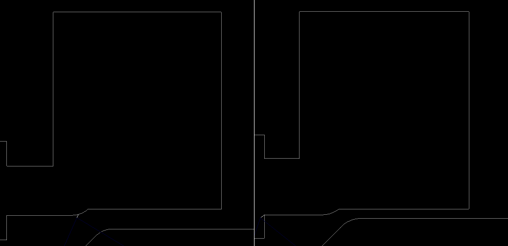
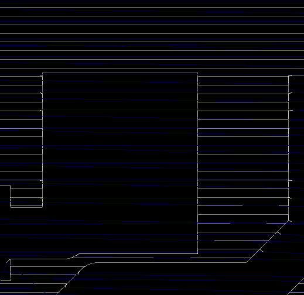
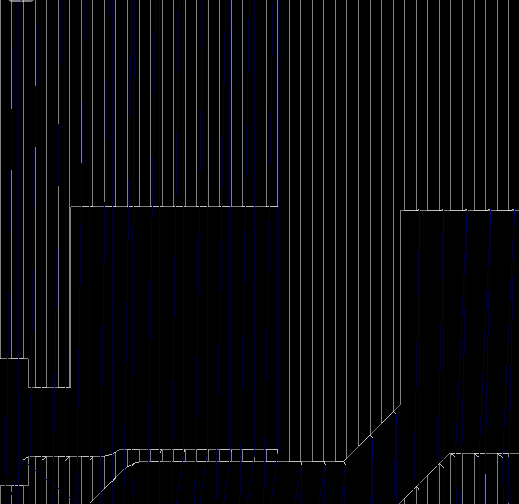
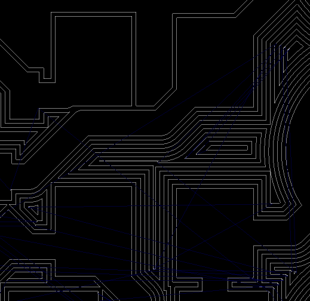
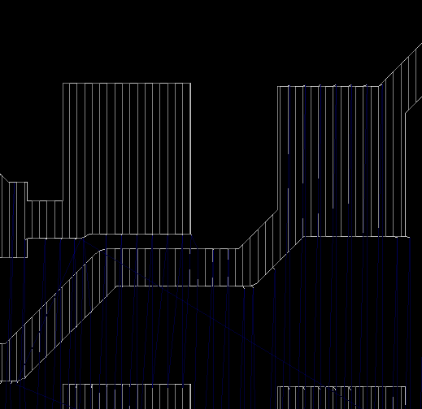

Documentation for `gbr2ngc`
===

Detailed documentation for `gbr2ngc`, a Gerber to GCode
converter.

## Command Line Options

```
$ ./gbr2ngc -h

gbr2ngc: A gerber to gcode converter
version 0.8.7

  usage: gbr2ngc [<options>] [<input_Gerber>] [-o <output_GCode_file>]

  -r, --radius radius                 radius (default 0) (units in inches)
  -F, --fillradius fillradius         radius to be used for fill pattern (default to radius above)
  -i, --input input                   input file
  -o, --output output                 output file (default stdout)
  -c, --config-file config-file       configuration file (default ./gbr2ngc.ini)
  -f, --feed feed                     feed rate (default 10)
  -s, --seek seek                     seek rate (add 'g0 f<rate>' to header if set)
  -z, --zsafe zsafe                   z safe height (default 0.1 inches)
  -Z, --zcut zcut                     z cut height (default -0.05 inches)
  -2, --gcode-header gcode-header     prepend custom G-code to the beginning of the program
  -3, --gcode-footer gcode-footer     append custom G-code to the end of the program
  -l, --segment-length segment-length minimum segment length
  -M, --metric                        output units in metric
  -I, --inches                        output units in inches (default)
  -C, --no-comment                    do not show comments
  -R, --machine-readable              machine readable (uppercase, no spaces in gcode)
  -H, --horizontal                    route out blank areas with a horizontal scan line technique
  -V, --vertical                      route out blank areas with a vertical scan line technique
  -G, --zengarden                     route out blank areas with a 'zen garden' technique
  -P, --print-polygon                 print polygon regions only (for debugging)
  --invertfill                        invert the fill pattern (experimental)
  --simple-infill                     infill copper polygons with pattern (currently only -H and -V supported)
  --no-outline                        do not route out outline when doing infill
  --height-file height-file           height file to use for height offseting
  --height-algorithm height-algorithm height algorithm to use (default Catmull-Rom) (options: catmull-rom, inverse-square, delaunay-linear)
  -v, --verbose                       verbose
  -N, --version                       display version information
  -h, --help                          help (this screen)

```

## Quick Guide

| Command Line Option | Description |
|--------------------|-------------|
| [`-r radius`](#-r-radius) | Radius of the tool bit.  This will create an 'offset' polygon from the implied polygon source from the Gerber file.  (Defaults `0`). |
| [`-F fillradius`](#-f-fill-radius) | Radius of tool bit to be used for routing out the 'fill pattern'. Default to tool radius (`-r` option). |
| [`-i gerber-file`](#-i-gerber-file) | Input Gerber file |
| [`-o gcode-file`](#-o-gcode-file) | Output GCode file (Default `stdout`). |
| [`-f feed-rate`](#-f-feed-rate) | Feed rate to use (`G0` move) in output GCode file (Default to `10`). |
| [`-s seekrate`](#-s-seek-rate) | Seek rate to use (`G1` move) in output GCode file (Default to `100`). |
| [`-z z-safe-height`](#-z-zsafe) | Height to move Z-axis when not cutting and doing rapid motion (a `G1` GCode move) (Default to `0.1 inches`). |
| [`-Z z-cut-height`](#-z-zcut) | Height to move Z-axis when cutting (slow motion, `G0` move) (Default to `-0.05 inches`). |
| [`-M`](#-m) | Use metric units in GCode file. |
| [`-I`](#-i) | Use imperial units in GCode file (Default). |
| [`-C`](#-c) | Do not provide comments in resulting GCode file. |
| [`-R`](#-r) | Make the GCode file more "machine readable" by making it uppercase with no spaces in output GCode. |
| [`-H`](#-h) | Do a routing fill, taking out unused material using a "horizontal scan line" technique. |
| [`-V`](#-v) | Do a routing fill, taking out unused material using a "vertical scan line" technique. |
| [`-G`](#-g) | Do a routing fill, taking out unused material using a "Zen Garden" technique". |
| [`-P`](#-p) | Print out the implied polygons in "gnuplot format" instead of the GCode file.  Used for debugging. |
| [`--invertfill`](#--invertfill) | Invert fill and non-fill areas |
| [`--simple-infill`](#--simple-infill) | Route out used copper material using the specified pattern (instead of routing out unused copper material) |
| [`--no-outline`](#--no-outline) | Do not route out outline when doing infill |
| [`--height-file heightfile`](#--height-file) | Use `heightfile` for Z interpolation |
| [`--height-algorithm height-algorithm`](#--height-algorithm) | Height interpolation algorithm (default Catmull-Rom) (options are `catmull-rom`, `inverse-square`, `delaunay-linear`) |
| [`-v`](#-v-1) | Verbose mode. |
| [`-N`](#-n) | Show version information. |
| [`-h`](#-h-1) | Show help. |

## Detailed Description

### `-r radius`

To account for the tool width, the tool radius can be specified which will do polygon offsetting, inflating the outline of the polygons to be routed by
the specified too radius amount.

For example:

```
$ gbr2ngc -r 0.05 -i ../example/fet.gbr
```

The left image is without an offset radius, the right image is with an offset radius of `0.05`:




### `-F fill-radius`

A different tool width can be specified when routing out unused copper regions by specifying the `fill-radius` tool radius.

This option must be used with one of `-H`, `-V` or `-G` fill options or other other `infill` options.

### `-i gerber-file`

Specify the input Gerber file.  This option can be `-` to indicate the file should be read from `stdin`.

Example:

```
$ gbr2ngc -i ../example/fet.gbr 
```

### `-o gcode-file`

An optional parameter for where the output GCode should be stored.  If no option is specified, output to `stdout`.

Example:

```
$ gbr2ngc -i ../example/fet.gbr -o ../example/fet.ngc
```

### `-f feed-rate`

Specify the feed rate for the output GCode file.

Example:

```
$ gbr2ngc -i ../example/fet.gbr -f 112
( union path size 5 )
g21
g90
f112
g1 z0.100000

( feed 112 zsafe 0.100000, zcut -0.050000 )

...
```

### `-s seek-rate`

Currently not implemented.

### `-z zsafe`

Specify the "safe" Z height where rapid (`G1`) motion should occur.

```
$ gbr2ngc -i ../example/fet.gbr -z 1.2
( union path size 5 )
g21
g90
f10
g1 z1.200000

( feed 10 zsafe 1.200000, zcut -0.050000 )


( path 0 )
g0 x19.921924 y-21.757760
g1 z-0.050000
g1 x19.959543 y-21.743493
...
```

### `-Z zcut`

Specify the "cut" Z depth, where the cutting tool should plunge to do the cut.

Example:

```
$ gbr2ngc -i ../example/fet.gbr -Z -0.0215
( union path size 5 )
g21
g90
f10
g1 z0.100000

( feed 10 zsafe 0.100000, zcut -0.021500 )


( path 0 )
g0 x19.921924 y-21.757760
g1 z-0.021500
g1 x19.959543 y-21.743493
g1 x19.994386 y-21.723376
g1 x20.025551 y-21.697931
...
```

### `-M`

Use metric units for resulting GCode file.

Example:

```
$ gbr2ngc -i ../example/fet.gbr -M
( union path size 5 )
g21
g90
f10
g1 z0.100000

( feed 10 zsafe 0.100000, zcut -0.050000 )


( path 0 )
g0 x19.921924 y-21.757760
g1 z-0.050000
g1 x19.959543 y-21.743493
g1 x19.994386 y-21.723376
g1 x20.025551 y-21.697931
g1 x21.218683 y-20.504798
...
```


### `-I`

Use imperial units for resulting GCode file.

Example:

```
$ gbr2ngc -i ../example/fet.gbr -I
( union path size 5 )
g20
g90
f10
g1 z0.100000

( feed 10 zsafe 0.100000, zcut -0.050000 )


( path 0 )
g0 x0.784328 y-0.856605
g1 z-0.050000
g1 x0.785809 y-0.856043
g1 x0.787181 y-0.855251
g1 x0.788408 y-0.854249
...
```

### `-C`

Don't provide comments in GCode file.

Example:

```
$ gbr2ngc -i ../example/fet.gbr -C
g21
g90
f10
g1 z0.100000


g0 x19.921924 y-21.757760
g1 z-0.050000
g1 x19.959543 y-21.743493
g1 x19.994386 y-21.723376
...
```

### `-R`

Make output more "machine readable" by converting all GCodes to uppercase and removing extra whitespace in each output line.

Example:

```
$ gbr2ngc -i ../example/fet.gbr -R
G21
G90
F10
G01Z0.100000
G00X19.921924Y-21.757760
G01Z-0.050000
G01X19.959543Y-21.743493
G01X19.994386Y-21.723376
G01X20.025551Y-21.697931
G01X21.218683Y-20.504798
...
```

### `-H`

The default is to do 'isolation routing' without taking up the unused material (e.g. copper) unnecessarily.
The `-H` option will route out unused material with a "horizontal" fill pattern.

One of `-r` or `-F` must be specified.

Example:

```
$ gbr2ngc -r 0.05 -H -i ../example/fet.gbr -o ../example/fet.ngc
```



### `-V`

The default is to do 'isolation routing' without taking up the unused material (e.g. copper) unnecessarily.
The `-V` option will route out unused material with a "vertical" fill pattern.

One of `-r` or `-F` must be specified.

Example:

```
$ gbr2ngc -r 0.05 -V -i ../example/fet.gbr -o ../example/fet.ngc
```



### `-G`

The default is to do 'isolation routing' without taking up the unused material (e.g. copper) unnecessarily.
The `-G` option will route out unused material with a "zen garden" fill pattern.

One of `-r` or `-F` must be specified.

Example:

```
$ gbr2ngc -r 0.05 -G -i ../example/fet.gbr -o ../example/fet.ngc
```



### `-P`

Output polygon regions in "gnuplot" format instead of GCode format.

Example:

```
$ gbr2ngc -i ../example/fet.gbr -P


15200690000 18446744048109121616
17001550000 18446744048109121616
17001550000 18446744050509981616
15200690000 18446744050509981616
15200690000 18446744048109121616


15200690000 18446744055309121616
17001550000 18446744055309121616
17001550000 18446744057709981616
15200690000 18446744057709981616
15200690000 18446744055309121616


18140040000 18446744053591461616
18739480000 18446744053591461616
18739480000 18446744054592221616
18140040000 18446744054592221616
18140040000 18446744053591461616


19440520000 18446744053591461616
20039960000 18446744053591461616
20039960000 18446744054592221616
19440520000 18446744054592221616
19440520000 18446744053591461616

...
```

### `--invertfill`

Invert the fill pattern (experimental).


### `--simple-infill`

Route out material that would normally be kept with a simple pattern, either horizontal (`-H`) or vertical (`-V`) infill.

The option `-H` or `-V` must also be specified along with a fill radius (`-F`).

```
gbr2ngc -F 0.05 -V --simple-infill -i ../example/fet.gbr
```



### `--no-outline`

When doing the infill, do not cut out the outline.

Example:

```
$ gbr2ngc -F 0.05 --no-outline --simple-infill  -H -i ../example/fet.gbr
```


### `--height-file`

Use the `heightfile` specified to do Z interpolation.

The `heightfile` is in "gnuplot" format.
Each line represents an `x y z` coordinate, one coordinate per line.

Blank lines are ignored and lines that start with a `#` are ignored.

See the [test height map file](../tests/height-offset/height-map.gp) for an example.

Here are the first few lines of the test file:

```
1.0 -5.0 0.103683567899
1.0 -4.55 -0.0395941699763
1.0 -4.1 0.105046479977
1.0 -3.65 -0.0804195838274
1.0 -3.2 -0.0460371193185
1.0 -2.75 0.0333288983645
1.0 -2.3 0.0434222152031
```

Note that coordinates will be sorted if need be so the input need not be sorted.

### `--height-algorithm`

One of `catmull-rom`, `inverse-square` or `delaunay-linear`.

The default is `catmull-rom`.

The [Catmull Rom](https://en.wikipedia.org/wiki/Centripetal_Catmull%E2%80%93Rom_spline) algorithm assumes a uniform grid.

The inverse square algorithm does an inverse square weighting of the neighboring sensed heights to find the interpolated Z coordinate.

The Delaunay-Linear algorithm attempts a [Delaunay triangulation](https://en.wikipedia.org/wiki/Delaunay_triangulation) of the coordinates
and then does a linear interpolation on the triangle the coordinate is on to find the Z interpolated point.

Interpolating coordinates outside of the height sensed area is undefined.

### `-v`

Verbose mode.

### `-N`

Display version.

### `-h`

Show help.
